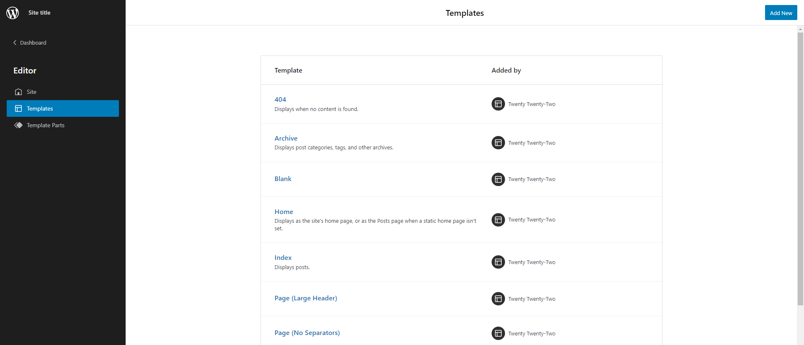

# Full Site Editing

With the introduction of WordPress 5.9 the block editor can now be used to edit the entire website, including the header, navigation menus, sidebars, footer and layouts.

This is achieved with a new type of theme called a Block Theme. The core difference between classic themes and block themes is that your template files are HTML rather than PHP, containing a combination of raw HTML and block editor comments.

[For a more in depth overview and comparison to classic themes see the WordPress Theme Handbook](https://developer.wordpress.org/themes/block-themes/).

## Enabling FSE

To add Full Site Editing (FSE) support to a theme, and make it a Block Theme, you will need an `index.html` file in a directory called `templates`. The file does not need to contain any code.

This is in addition to the classic theme minimum requirements of an `index.php` file and a `style.css` file.

## Creating a Block Theme

### Block Theme Templates

In the same way a classic theme uses specific files like `single.php`, and `404.php` for different page templates, WordPress will look for and load the corresponding HTML templates in an FSE theme, so you would have the files `templates/single.html`, `templates/404.html` and so on. These take precendence over any matching PHP templates.

In block themes the `<head>` and `<body>` elements are added for you. Necessary PHP hooks that you would add to a classic theme, including `wp_head()`, `wp_body_open()`, and `wp_footer()`, are also added automatically. The markup that is inside the template file is printed between the opening and closing body tags.

### Site Editor



HTML templates can be created in code or by using the new Site Editor in the WordPress admin. Templates created in code serve as the default configuration for a template and can be modified in the Site Editor. The Site Editor can even be used to create the templates, and then the code can be copied into the HTML template files rather than having to hand code them.

[Learn how to create or edit existing themes in the Site Editor here](https://developer.wordpress.org/themes/block-themes/creating-new-themes-using-the-site-editor/).

### Example Block Theme File Structure

```
assets (dir)
      - css (dir)
            - blocks (dir)
      - images (dir)
      - js (dir)
inc (dir)
      - blocks (dir)
patterns (dir)
      - author-credit.php
parts (dir)
      - footer.html
      - header.html
templates (dir)
      - 404.html
      - archive.html
      - index.html
      - page.html
      - single.html
      - search.html
functions.php
index.php
style.css
editor-style.css
theme.json
```

### Template Parts

In addition to `templates` that are used for the layout of entire pages, block themes can use the new Template Part block to include reusable partial templates. These must be placed in the `parts` directory.

For example `parts/header.html` may look like this:

```html
<!-- wp:site-title /-->
```

And `templates/index.html` like this:

```html
<!-- wp:template-part {"slug":"header"} /-->
```

To make template parts available to use in the block editor they need to be registered in the `theme.json` file like so:

```json
{
    "templateParts": [
        {
            "name": "header",
            "title": "Header",
            "area": "header"
        }
    ]
}
```

The `name` corresponds to the file name, `title` is a human-readable title for the part and `area` denotes where the template part can go, one of `header`, `general` and `footer`.

[You can find further reading about Template Parts here](https://developer.wordpress.org/themes/block-themes/templates-and-template-parts/).


### Block Patterns

Block Patterns allow you to create reusable patterns of blocks that do not need to be created as reusable blocks in the admin. They are similar to template parts but can be used in any block editor context, template part or template.

Using Block Patterns is necessary to provide translatable text in HTML templates, they can be included using the core pattern block like so:

```html
<!-- wp:core/pattern {"slug":"my-theme/author-credit"} -->
```

An example block pattern file might look like the following:

```php
<?php

namespace My_Theme\Patterns\Author_Credit;

add_action( 'init', __NAMESPACE__ . '\register' );

function register() {
    register_block_pattern(
        'my-theme/author-credit',
        [
            'title'  => __( 'Author Credit', 'my-plugin' ),
            'description' => _x( 'Shows author avatar and bio', 'my-plugin' ),
            'content' =>
                '<div class="author-credit">' .
                    '<h3>' . esc_html__( 'Author' ) . '</h3>' .
                    '<!-- wp:post-author {"avatarSize":100,"showBio":true} /-->' .
                '</div>',
        ]
    );
}
```

[Read more about block patterns on the Block Editor Handbook](https://developer.wordpress.org/block-editor/reference-guides/block-api/block-patterns/).


### Theme Blocks

Block Themes can use additional core blocks that map to classic functionality like `the_title()` and `the_content()` functions, for example `<!-- wp:post-title /-->` and `<!-- wp:post-content /-->`.

An important combination of theme blocks is the Query Block and Post Template. These provide context to the blocks nested within them, allowing you to use the loop within HTML templates, for example:

```html
<!-- wp:query {"queryId":1,"query":{"offset":0,"postType":"post"}} -->
    <!-- wp:post-template -->
        <!-- wp:post-title {"isLink":true} /-->
        <!-- wp:post-excerpt /-->
    <!-- /wp:post-template -->
<!-- /wp:query -->
```

[The full core block reference can be found here](https://developer.wordpress.org/block-editor/reference-guides/core-blocks/).


## Resources

### Themes

You can experiment with FSE by installing and looking at existing examples:

- [Twenty Twenty Two Theme](https://en-gb.wordpress.org/themes/twentytwentytwo/): the new default theme with FSE support
- [Empty Theme](https://github.com/WordPress/theme-experiments/tree/master/emptytheme): a sample empty theme to start building from
- [Full Site Editing tag on WordPress.org themes repository](https://en-gb.wordpress.org/themes/tags/full-site-editing/)

### Courses

- [Building Block Themes by Fränk Klein](https://wpdevelopment.courses/courses/building-block-themes/)

### Handbooks

- [Block Editor Handbook](https://developer.wordpress.org/block-editor/)
- [Theme Handbook](https://developer.wordpress.org/themes/block-themes/)
- [fullsiteediting.com](https://fullsiteediting.com/): Comprehensive resources, tools and references for blocks and block themes
